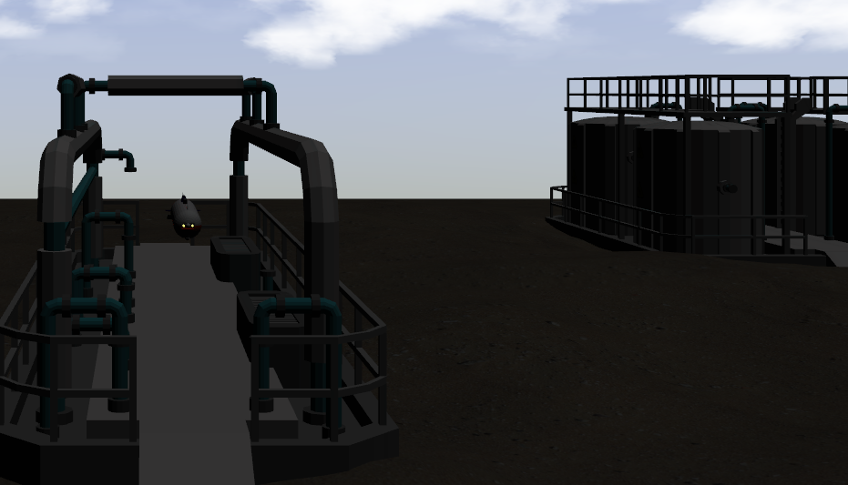

# REMARO_Scenarios

This repository belongs to different scenarios extracted from [REMARO worlds](https://github.com/remaro-network/remaro_worlds)

## ScreenVideo

[](assets/GIFs/docking_station.mp4)

## Installation
 - Install [Ubuntu 20 LTS](https://releases.ubuntu.com/20.04/ubuntu-20.04.3-desktop-amd64.iso).

- Install [ROS Noetic](http://wiki.ros.org/noetic/Installation/Ubuntu).  Choose the "Desktop-Full Install" option so simulators are installed.

- Once you have installed ros packages, the <b>uuv_simulator</b> can be installed by cloning the a modified version of `Field-Robotics-Lab_uuv_simulator` repository [here](https://github.com/mahyamkashani/uuv_simulator) in your ros workspace.


```bash
# Make directory for your workspace
mkdir -p ~/yourworkspacename/src

# Change directory to your workspace
cd ~/yourworkspacename/src

# Clone this package 
git clone https://github.com/remaro-network/remaro_scenarios.git

# Clone BlueRov2 package 
git clone https://github.com/mahyamkashani/bluerov2

# Clone REMARO_AUV package
git clone https://github.com/jpcoffelt/remaro_auv

# Move to root of your workspace directory
cd ~/yourworkspacename

# Make the workspace 
catkin_make

# Source your workspace in each terminal using this package.
source ~/yourworkspacename/devel/setup.bash

# If this is your only active ROS workspace,
# modify ~./bashrc to automatically source this workspace.
echo "source ~/yourworkspacename/devel/setup.bash" >> ~/.bashrc
```

## Usage
```bash
# To launch the simulated world
roslaunch remaro_scenarios launch_remaro_auv_docking_station.launch
```

## Acknowledgements
This project has received funding from the European Union’s Horizon 2020 research and innovation programme under the Marie Skłodowska-Curie grant agreement No. 956200.

Pleave visit [our website](https://remaro.eu/) for more info on our project.


